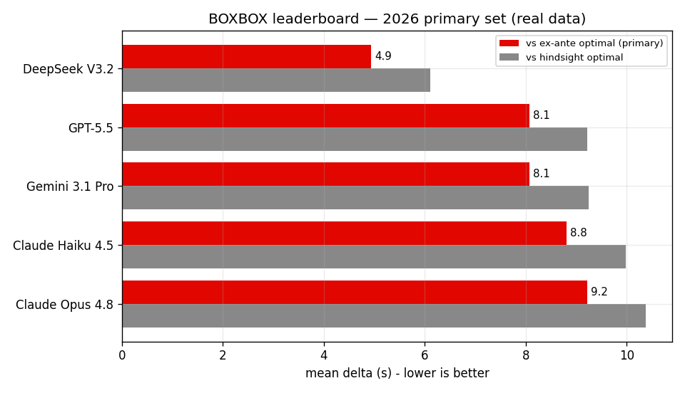

# BOXBOX

[](https://github.com/AnassNadeem/BoxBox/actions/workflows/ci.yml)

**Can frontier LLMs call an F1 race?**

BOXBOX is a contamination-resistant benchmark that tests whether large language models can make Formula 1 pit-stop strategy decisions in real time. We reconstruct *decision points* from real 2026 races — *pit now or stay out? which compound?* — feed the identical frozen race state to five frontier models, and score every call against an ex-ante optimal strategy computed by a race simulator.

Because every completed 2026 race postdates all models' training data, the 2026 test set is designed to resist contamination by construction. A direct test against a 2024/2025 control set finds a weak and inconsistent signal — see the paper's Section 4.5 for the full result and its caveats.

*A sixth model, Claude Fable 5, was in the original design but became unavailable due to an export-control directive before the main run — see the paper's Section 4.6 for the 3 data points it produced before withdrawal.*

---

## Results (primary set: 125 dry decision points · 2026 season · 5 models)



| # | Model | Mean Δ ex-ante (s) ↓ | Median (s) | Beat team % | Flip rate % |
|---|-------|---------------------:|------------|------------:|------------:|
| 1 | deepseek-v3.2 | **4.93** | 0.0 | 19.2% | 38.9% |
| 2 | gpt-5.5 | 8.08 | 0.0 | 19.4% | 50.0% |
| 3 | gemini-3.1-pro | 8.08 | 0.0 | 20.0% | 22.2% |
| 4 | claude-haiku-4.5 | 8.81 | 0.0 | 16.0% | 0.0% |
| 5 | claude-opus-4.8 | 9.21 | 0.0 | **24.0%** | **5.6%** |

*Primary metric: **mean Δ ex-ante** — seconds lost vs. the no-future-SC optimal strategy (lower is better). Primary set = the 125 dry decision points from the post-cutoff 2026 season (matches paper Table 2).*

**Key findings:**
- DeepSeek V3.2 leads on raw accuracy but reverses its own call on identical inputs ~2 in 5 times (flip rate 38.9%).
- Model price does not predict decision quality: the cheapest (open-weight) model has the lowest mean delta, and there is no evidence costlier models decide better.
- Accuracy and self-consistency diverge: Claude Haiku 4.5 never flips (0.0%) and Opus rarely does (5.6%), while GPT-5.5 flips on half the probed points — the most accurate model is among the least consistent.
- All models show median delta = 0 — they mostly stay out when the team stays out, but are penalised on the minority of laps where the optimal call is to pit.
- **Mixed contamination signal** (Mann-Whitney U, Holm-corrected): deepseek-v3.2 and gemini-3.1-pro do slightly better on 2024-25 races (weak recall direction), but gpt-5.5 and claude-haiku-4.5 do significantly *worse* on older races (opposite direction), and claude-opus-4.8 shows no gap. The signal is too weak and inconsistent to overturn the rankings. A same-circuit comparison (Monaco, all three seasons) shows no consistent pattern. See the paper's Section 4.5.

### Robustness check — full set (177 dry decision points, all 3 seasons)

The full set pools all three seasons (177 dry DPs, 883 valid scored calls). DeepSeek remains first; the middle of the table reorders, consistent with overlapping confidence intervals (paper Appendix C).

| # | Model | Mean Δ ex-ante (s) ↓ | Median (s) | Beat team % | Flip rate % |
|---|-------|---------------------:|------------|------------:|------------:|
| 1 | deepseek-v3.2 | **4.74** | 0.0 | 18.1% | 38.9% |
| 2 | gemini-3.1-pro | 7.11 | 0.0 | 18.2% | 22.2% |
| 3 | claude-opus-4.8 | 7.34 | 0.0 | **21.5%** | **5.6%** |
| 4 | gpt-5.5 | 8.54 | 0.5 | 17.6% | 50.0% |
| 5 | claude-haiku-4.5 | 12.66 | 0.0 | 15.3% | 0.0% |

*Dry subset of all 11 races; 19 changeable-condition DPs excluded from the 196 total (v1 simulator cannot model wet→dry crossovers).*

---

## Races

| Set | Races | Decision points |
|-----|-------|-----------------|
| **2026 (primary, post-cutoff)** | Australia, China, Japan, Miami, Monaco, Canada, Barcelona | 125 dry DPs (+1 excluded, wet) |
| **2024/25 (contamination control)** | Bahrain 2024, Monaco 2024, Monaco 2025, Silverstone 2025 | 52 dry DPs (+18 excluded, wet) |

*177 dry decision points total (196 including changeable-condition exclusions).*

---

## Quick start

```bash
pip install -r requirements.txt
pytest                                   # all tests green
python scripts/build_dataset.py          # ingest -> extract -> data/decision_points/
python scripts/run_benchmark.py --mock   # mock mode: $0, fully deterministic
python scripts/score_results.py          # scores -> outputs/leaderboard.{md,csv,json}
python -m boxbox.live.replay --race monaco-2026 --speed 60 --mock
```

Real model runs require `.env` with `OPENROUTER_API_KEY` and `ALLOW_SPEND=1` (see `.env.example`).

```bash
python scripts/verify_models.py          # verify model IDs against OpenRouter
python scripts/run_benchmark.py          # main pass only (flexible: --models, --limit)
python scripts/run_full_benchmark.py     # main pass + probe in one shot (paper run)
python scripts/run_consistency_probe.py  # probe only, after a completed main pass
python analysis/figures.py               # regenerate all paper figures
```

> **`run_benchmark.py` vs `run_full_benchmark.py`:** Use `run_benchmark.py` for development — it accepts `--models`, `--limit`, and `--mock` flags for partial or mock runs. `run_full_benchmark.py` is the locked-down paper run: it executes the full preregistered roster (5 models × all DPs) plus the consistency probe in sequence on a single shared spend cap, with no flags needed. Both write to `outputs/raw_results/`; run `score_results.py` afterwards in either case.

---

## How it works

```
FastF1 / OpenF1
      │
      ▼
  RaceData  ──────────────────────────────────────────────────────┐
      │                                                            │
      ▼                                                            │
DecisionPoints  ←  rule-based extractor (pit neighborhoods,       │
  (Type A/B/C)      SC/VSC moments, undercut threats)             │
      │                                                            │
      ▼                                                            │
  Harness  ──→  OpenRouter  ──→  model responses (JSON)           │
      │                                                            │
      ▼                                                            │
  Simulator  ←─────────────────────────────────────────────────────┘
  (per-car degradation fit + counterfactual rollout)
      │
      ▼
  Score  ──→  outputs/leaderboard.{md,csv,json}
                      │
                      ▼
               site/index.html  (static leaderboard)
```

1. **Ingest** (`boxbox.data`) — FastF1 (OpenF1 fallback) → normalised `RaceData`.
2. **Extract** (`boxbox.extract`) — rule-based Type A/B/C decision points. State at lap *t* contains zero information from after lap *t−1* (plus current track status). Leakage is tested.
3. **Simulate** (`boxbox.sim`) — per-car tyre-degradation fits + pit-loss estimates → counterfactual race time for any candidate strategy → ex-ante optimum (no future SC knowledge).
4. **Harness** (`boxbox.harness`) — identical prompts to every model via OpenRouter, strict JSON answers, SHA-256 disk cache, cost ledger, mock mode.
5. **Score** (`boxbox.score`) — `Δ_exante = sim(model action) − sim(ex-ante optimal)`; plus beat-the-team rate, invalid rate, consistency flip rate → leaderboard.
6. **Live** (`boxbox.live`) — Sunday demo loop: poll OpenF1, trigger decisions, draft (never post) social updates. Replay mode runs historic races through the same pipeline.

---

## Module map

| Path | Purpose |
|------|---------|
| `src/boxbox/data/schemas.py` | All pydantic v2 models (single source of truth) |
| `src/boxbox/data/ingest.py` | FastF1 → RaceData normalisation |
| `src/boxbox/data/openf1.py` | OpenF1 REST client (historic + live) |
| `src/boxbox/extract/decision_points.py` | Rule-based Type A/B/C extractor |
| `src/boxbox/sim/` | Degradation fits, race simulator, optimal search |
| `src/boxbox/harness/` | Prompt templates, disk cache, OpenRouter runner |
| `src/boxbox/score/` | Per-call scoring + leaderboard aggregation |
| `src/boxbox/live/` | Live Sunday loop + Nx-speed replay |
| `scripts/` | Thin CLI wrappers over the library |
| `analysis/figures.py` | Paper figures (PNG → `outputs/figures/`) |
| `site/index.html` | Static leaderboard page |

---

## Outputs

| File | Description |
|------|-------------|
| `outputs/leaderboard.md` | Human-readable leaderboard |
| `outputs/leaderboard.csv` | Machine-readable leaderboard |
| `outputs/leaderboard.json` | Leaderboard consumed by `site/index.html` |
| `outputs/scores.jsonl` | Per-call scored results |
| `outputs/hypothesis_tests.md` | Pre-registered H1/H2/H3 statistical tests |
| `outputs/contamination.md` | Per-model contamination analysis |
| `outputs/cost_ledger.csv` | Per-call token + cost tracking |
| `outputs/fable_comparison.md` | Claude Fable 5 exploratory data points (export-control withdrawal context) |
| `outputs/figures/` | All paper figures (PNG) |

---

## Pre-registration

Before running any model on the full dataset, the design, hypotheses, and analysis plan were written down and committed to this repository with a timestamp, so the results could not be shaped by what the data showed.

Hypotheses were pre-registered before data collection. The full procedure is in `docs/PREREGISTRATION.md`; amendments are in `docs/DECISIONS.md`. The pre-registration trail is anchored to git tags:

```bash
git show prereg-v1 --no-patch --format="%H %ai %s"
git show prereg-v4 --no-patch --format="%H %ai %s"
```

---

## Conventions

- Python 3.11+, pydantic v2, pytest. Formatting: `black` + `ruff`.
- All thresholds live in `config/extraction.yaml` — never hardcoded.
- Every assumption → `docs/DECISIONS.md` with one-line rationale.
- Time units: seconds (float) everywhere. Laps are 1-indexed ints.
- Mock mode is the default. Real runs require `ALLOW_SPEND=1` + `OPENROUTER_API_KEY`.

---

## Paper

Full manuscript: [`paper/BOXBOX_Report.pdf`](paper/BOXBOX_Report.pdf)

Muhammad Anas Nadeem · Department of Computer Science, Brunel University London
