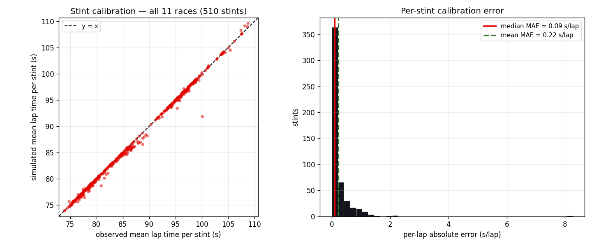
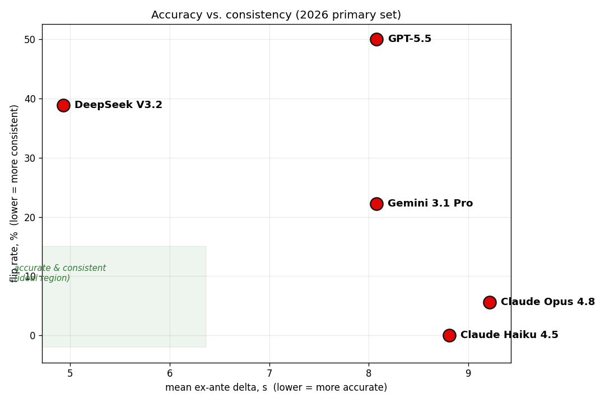
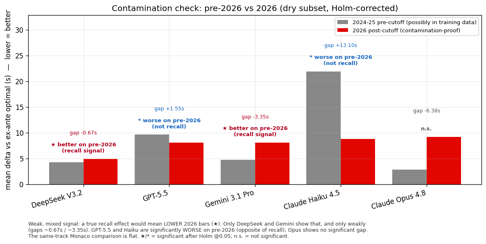

<!-- ============================ COVER PAGE ============================ -->

<div align="center">

&nbsp;

&nbsp;

# BOXBOX

## Evaluating Large Language Models on Sequential Race-Strategy Decisions

### A Contamination-Resistant Benchmark from Formula 1

&nbsp;

&nbsp;

**Muhammad Anas Nadeem**

Department of Computer Science
Brunel University London

&nbsp;

**[DECISION: confirm exact name, department wording, and whether to add an email and the public repository URL on the cover.]**

&nbsp;

&nbsp;

June 2026

&nbsp;

&nbsp;

*A preregistered benchmark and its full data, code, and amendment history are publicly available.*

</div>

<!-- pagebreak -->

---

## Abstract

Large language models are increasingly proposed as decision-makers in sequential, high-stakes settings, yet evaluating their decision quality is difficult: benchmarks risk contamination from training data, and the quality of a real decision is hard to score objectively. We introduce BOXBOX, a benchmark that evaluates language models on Formula 1 race-strategy decisions, where choices are discrete, outcomes are objectively quantifiable in time, and a fresh post-cutoff season provides test data no current model could have memorised. From eleven races we extract 196 decision points by fixed rules, score each model's call against an ex-ante optimum computed by a calibrated race simulator, and compare against the decisions taken by professional team strategists. On the primary evaluation set of 125 dry decision points from the 2026 season, we report three findings. First, every model evaluated falls well short of the human pit wall, beating the real team call on between 16 and 24 percent of decisions. Second, model price does not predict decision quality: the cheapest model tested, an open-weight model priced roughly two orders of magnitude below the flagships, achieves the lowest mean distance from optimal, and we find no evidence that costlier models decide better. Third, accuracy and self-consistency diverge sharply: the most accurate model reverses its own decision on identical inputs in roughly two of five cases, while one flagship reverses itself in half. A test for training-data recall finds a weak and inconsistent signal in two of five models, not corroborated by a same-circuit comparison, indicating at most a modest effect rather than the strong memorisation that would invalidate the benchmark. Code, data, and the full preregistration are public.

<!-- pagebreak -->

## Table of Contents

1. Introduction
2. Related Work
3. Method
   - 3.1 Data
   - 3.2 Decision-point extraction
   - 3.3 The race simulator
   - 3.4 Models and prompting
   - 3.5 Scoring
   - 3.6 Preregistration and amendments
4. Results
   - 4.1 Simulator calibration
   - 4.2 Distance from optimal: model performance
   - 4.3 Comparison with human strategists
   - 4.4 Consistency: accuracy is not reliability
   - 4.5 Contamination analysis
   - 4.6 Claude Fable 5: an exploratory observation
5. Discussion
6. Limitations
7. Conclusion
8. References
- Appendix A: Prompt and output schema
- Appendix B: Preregistration amendment trail
- Appendix C: Full-set leaderboard
- Appendix D: Performance by decision type
- Appendix E: Reproducibility

<!-- pagebreak -->

## 1. Introduction

Language models are being deployed, and proposed for deployment, in settings that require a sequence of consequential decisions under uncertainty: triage, operations, trading, planning. Evaluating whether they are any good at this is harder than it appears. Two problems recur. The first is contamination: a model tested on past events may be recalling outcomes seen during training rather than reasoning from the situation presented, a concern now well documented across static benchmarks (Deng et al., 2024; Xu et al., 2024). The second is scoring: in most real decision settings there is no clean, objective measure of how good a particular decision was, only the eventual result, which conflates the decision with everything that followed it.

Formula 1 race strategy is an unusually clean setting in which to study both problems. The decisions are discrete and well defined: at a given moment, a team chooses whether to bring a car into the pits and which tyre compound to fit. The consequences are measured in time, which is objective and continuous. The sport produces rich, public, lap-by-lap data. And it runs a fresh season every year, so that a benchmark built on the latest season tests decisions that occurred after every current model's training cutoff, removing the contamination problem by construction rather than by assumption. This logic of building evaluations on material released after training mirrors recent contamination-limited benchmarks in other domains (White et al., 2024).

We use these properties to build BOXBOX, a benchmark of race-strategy decisions. We extract decision points mechanically from real races, present each to a language model as the situation a strategist would face, and score the model's choice against a simulated optimum and against the decision the real team made. One of the eleven races in the benchmark, the 2026 Spanish Grand Prix at Barcelona, was held only days before this benchmark was finalised, illustrating the design's central property: its hardest-to-contaminate data is also its most recent. Our contributions are:

1. A contamination-resistant benchmark for sequential decision quality, built on a post-cutoff season, with mechanical extraction and an objective, simulator-based scoring method.
2. An evaluation of five contemporary language models showing that all fall well short of professional human strategists, and that decision quality is not predicted by model price.
3. Evidence that accuracy and self-consistency are distinct and weakly related properties, with implications for how language models are evaluated before deployment as decision-makers.
4. A fully preregistered and publicly reproducible methodology, including the complete record of amendments made during the study.

## 2. Related Work

Our work connects three strands of prior research.

The first is the evaluation of language models and the problem of data contamination. As models are trained on ever larger web corpora, benchmark questions and their answers increasingly appear in training data, inflating measured performance and undermining the validity of static benchmarks (Deng et al., 2024). Recent surveys frame this benchmark data contamination as a systemic threat to static evaluation (Xu et al., 2024), and proposed mitigations include the use of frequently updated or recently released material that postdates training (White et al., 2024). Our design follows this logic, using a sporting season that postdates the models' training cutoffs as a naturally contamination-resistant test set.

The second is the use of language models for sequential decision-making and planning under uncertainty. A growing literature evaluates models as agents that must choose actions over time rather than answer single questions (Klissarov et al., 2024), and benchmarks such as AgentBench assess models across interactive environments (Liu et al., 2024). Much of this work scores task completion; we focus instead on the quality and consistency of individual decisions measured against an objective optimum.

The third is computational and data-driven analysis of motorsport strategy. Simulation and optimisation approaches to pit-stop timing and tyre choice have a long history in operational research (Bekker and Lotz, 2009), and more recent work applies detailed lap-wise race simulation (Heilmeier et al., 2018) and neural models for strategy decisions (Heilmeier et al., 2020). We draw on the modelling ideas in this literature to construct a transparent simulator, but our aim is not to optimise strategy; it is to use a simplified, consistently applied simulator as a yardstick for evaluating language-model decisions.

## 3. Method

### 3.1 Data

We construct the benchmark from eleven Formula 1 races, drawn from the 2024, 2025, and 2026 seasons. The race selection is governed by the central design constraint of this work: contamination resistance. Large language models are trained on data with a fixed cutoff, and any evaluation conducted on events preceding that cutoff risks measuring recall of memorised outcomes rather than genuine decision-making. We therefore designate the seven completed 2026 races as the primary evaluation set, since all postdate the training cutoff of every model under test and could not have been observed during training. Four earlier races, drawn from 2024 and 2025, serve as a contamination control: events that may plausibly appear in the training corpora, against which the primary set can be compared for evidence of recall.

The primary set comprises the 2026 Australian, Chinese, Japanese, Miami, Canadian, Monaco, and Spanish Grands Prix. The Spanish Grand Prix, held at Barcelona only days before this benchmark was finalised, is the most recent and was added once its timing data became complete. The 2026 Bahrain and Saudi Arabian rounds were cancelled and were never available. The control set comprises the 2024 Bahrain and Monaco Grands Prix and the 2025 Monaco and Silverstone Grands Prix. The inclusion of Monaco in all three seasons is deliberate: it provides a single circuit observed at three distinct levels of training exposure, permitting a within-circuit comparison that holds track characteristics approximately constant.

Race data were obtained from two public timing sources, FastF1 and OpenF1, which expose lap times, tyre stint information, pit-stop timing, classification, track status, and weather. From these we derive, for each race, the per-lap state of every car: position, tyre compound and age, intervals to adjacent cars, and the prevailing track status. All quantities used to construct a decision are restricted to information available at or before the lap in question, a constraint we formalise in Section 3.2.

The eleven races yield 196 decision points in total. After excluding decision points occurring in changeable (wet or drying) conditions, which fall outside the scope of the simulator described in Section 3.3, 177 decision points remain. Of these, 125 belong to the primary 2026 set and 52 to the control set. Table 1 reports the per-race composition.

*Table 1. Race composition: season, circuit, total laps, decision points by type (A pit-window, B safety-car, C undercut-threat), changeable-condition exclusions, and set membership.*

| Race | Season | Circuit | Laps | A | B | C | Total | Excluded | Set |
|---|---|---|---:|---:|---:|---:|---:|---:|---|
| Australia | 2026 | Melbourne | 58 | 6 | 6 | 6 | 18 | 0 | Primary |
| China | 2026 | Shanghai | 56 | 6 | 6 | 6 | 18 | 0 | Primary |
| Japan | 2026 | Suzuka | 53 | 6 | 6 | 6 | 18 | 0 | Primary |
| Miami | 2026 | Miami Gardens | 57 | 6 | 6 | 6 | 18 | 0 | Primary |
| Canada | 2026 | Montréal | 68 | 6 | 6 | 6 | 18 | 1 | Primary |
| Monaco | 2026 | Monte Carlo | 78 | 6 | 6 | 6 | 18 | 0 | Primary |
| Spain | 2026 | Barcelona | 66 | 6 | 6 | 6 | 18 | 0 | Primary |
| Bahrain | 2024 | Sakhir | 57 | 6 | 0 | 12 | 18 | 0 | Control |
| Monaco | 2024 | Monte Carlo | 78 | 11 | 0 | 5 | 16 | 0 | Control |
| Monaco | 2025 | Monte Carlo | 78 | 6 | 0 | 12 | 18 | 0 | Control |
| Silverstone | 2025 | Silverstone | 52 | 6 | 6 | 6 | 18 | 18 | Control |

*Note: safety-car (Type B) decision points are absent from the three Monaco races and 2024 Bahrain, where no qualifying neutralisation with a top-ten car was detected; the per-type quota redistributed those slots. 2024 Monaco yields 16 points, below the cap, after exclusions. The 2025 Silverstone race is wet throughout and contributes no points to the dry evaluation set.*

### 3.2 Decision-point extraction

A decision point poses a single strategic question at a specific lap: given the current race state, should the focal car pit at the end of this lap or stay out, and if it pits, onto which compound? Each decision point freezes the race at lap *t* for one car and records only the information a strategist would possess at that moment. We extract decision points mechanically, by fixed rules rather than manual selection, so that the benchmark cannot be shaped, consciously or otherwise, by knowledge of outcomes.

Three types of decision point are extracted, corresponding to the three situations in which pit-strategy decisions are most consequential. Type A (pit-window) decisions are sited around real pit stops: for every actual stop on lap *s*, we emit candidate decision points at laps *s−2*, *s−1*, and *s*, capturing the window in which the team committed to its call. Type B (safety-car) decisions are emitted at the first lap of each safety-car or virtual-safety-car period, for every car then running in the top ten, since neutralisations sharply alter the value of pitting. Type C (undercut-threat) decisions are emitted when a directly competing car pits: when a rival within one position and 3.5 seconds of the focal car stops on lap *s*, the focal car faces a decision at lap *s+1* on whether to respond.

To prevent any single race from being dominated by one decision type, we apply a per-race quota. Each race is capped at eighteen decision points with a target of six per type; where a type yields fewer than six candidates, its unused allocation is redistributed to the remaining types. Within a type, decision points involving the closest battles are retained first. Overlapping candidates for the same car and lap are deduplicated. We additionally exclude decision points in the opening three and closing two laps, decision points for lapped or imminently retiring cars, and decision points in changeable conditions, for the reasons given in Section 3.3.

The integrity of the benchmark rests on a strict separation between the information available to the model and the eventual outcome. The state presented to a model is constructed only from completed laps at or before *t*, together with the single piece of real-time information a pit wall genuinely possesses at lap *t*: the current track status. No future lap times, no future positions, and crucially no record of the team's actual decision or its result enter the state. We enforce this structurally: the construction of a state first truncates the race to laps at or before *t*, so that information from later laps cannot influence it by any path. This guarantee is verified by an automated test which asserts that deleting all laps after *t* from the input leaves every field of the resulting state unchanged. The team's real call and the realised outcome are retained separately, used only for scoring, and never serialised into the prompt.

The full state supplied for each decision comprises the circuit and total race length, the current lap and track status, an estimate of the pit-lane time loss, and the focal car's position, current compound and tyre age, compounds already used and still available, and recent lap times. It further includes the compound, age, and interval of the cars immediately ahead and behind, and a summary of the top ten running order. Available compounds include intermediate and wet tyres only when wet running was actually present in the race within five laps of the decision, a condition determined solely from laps at or before *t*.

> **⚠ FIGURE 1 NOT YET CREATED.** The decision-point schematic is a conceptual diagram that has never been auto-generated; it must be drawn by hand before submission (the author will handle this). The caption below is retained as a placeholder.

*Figure 1. Schematic of a single decision point: the frozen race state supplied to the model, with future laps and the team's actual call shown as withheld.*

### 3.3 The race simulator

Scoring a strategic decision requires a way to estimate its consequence. We therefore construct a race simulator that, given a decision and a candidate strategy, estimates the total remaining race time for the focal car. The simulator is deliberately simple and its assumptions are stated explicitly; its purpose is not to reproduce a race in full but to provide a consistent yardstick against which every model's call, and the team's actual call, are measured identically.

The core of the simulator is a per-car lap-time model. For each car and compound, we fit lap time as a linear function of tyre age and race lap, estimated by least squares on that car's clean laps, defined as timed, green-flag, dry laps that are neither in-laps nor out-laps. The tyre-age coefficient captures degradation; the race-lap coefficient captures the combined effect of fuel burn and track evolution. Where a car's clean laps come entirely from a single stint, tyre age and race lap are near-collinear and the two effects cannot be separated reliably; in that case the race-lap term is dropped and only degradation and base pace are fitted. Predictions are bounded by physical constraints: tyre age is capped at the maximum observed in clean running, and no predicted lap may be faster than the fastest clean lap of the race. Where a car has too few clean laps on a compound to fit reliably, we fall back in turn to its team-mate's fit, then to a pooled field fit, and finally, for a compound never run, to the slowest field fit with a fixed penalty.

Pit-lane time loss is estimated per race from the observed stops, as the time lost on the in- and out-laps relative to the car's clean-lap pace. Under safety-car or virtual-safety-car conditions, the effective loss is reduced by a factor estimated from neutralised stops where available, and otherwise set to a default reflecting the typical reduction.

Given these components, the simulator evaluates a candidate strategy by rolling the focal car forward from the decision lap to the end of the race, accumulating predicted lap times and adding the appropriate pit-lane loss at each stop. The actual safety-car timeline of the race is held fixed, and laps run under neutralisation are charged the field-median time observed on those laps rather than the degradation model, since pace under a safety car is dictated by the field rather than by tyre state. Only the focal car is simulated; the behaviour of all other cars is held at what actually occurred. This is the simulator's principal simplification: it does not model traffic interaction, so the time a car would lose rejoining among other cars is not represented beyond an optional fixed penalty, which we leave at zero in the reported results.

From this we define the quantity used to score every decision. For a given decision, the value of an action is the best total race time achievable by that action followed by its optimal continuation: the value of staying out is the best plan that does not stop at lap *t*, and the value of pitting onto a given compound is the best plan that does. The team's actual call is valued in the same way, so that agreement with the team at the decision instant scores as an exact tie. Against these action values we define two optima. The hindsight optimum is the candidate strategy minimising realised race time with full knowledge of the safety-car timeline. The ex-ante optimum is the strategy minimising race time under the assumption that the remainder of the race runs green, reflecting the information actually available to a strategist at the decision; the resulting plan is then valued in the realised race, so that both optima are expressed in the same currency. By construction the ex-ante optimum is never better than the hindsight optimum. We adopt the ex-ante optimum as the primary reference, since it measures distance from the best decision that was knowable at the time rather than from one that depended on foreknowledge of neutralisations.

The simulator embodies several simplifications beyond the absence of traffic. Degradation is modelled as linear, omitting the nonlinear cliff and warm-up behaviour of real tyres. The candidate space permits at most one further stop from the decision lap. Tyre availability is assumed rather than tracked, since the remaining allocation per car is not public. Safety-car laps are charged a field-median pace that ignores the value of track position gained or lost under neutralisation. We retain these simplifications deliberately, in favour of a transparent and consistently applied yardstick, and we quantify the fidelity of the resulting lap-time model in Section 4.1. Their consequences for interpretation are discussed in Section 6.



*Figure 2. Simulator calibration: predicted versus observed stint times across all races, with the distribution of per-lap absolute error.*

### 3.4 Models and prompting

We evaluate five language models accessed through a single provider gateway: Claude Opus 4.8, GPT-5.5, Gemini 3.1 Pro, DeepSeek V3.2, and Claude Haiku 4.5. The set spans a wide range of price and capability, from flagship models to a substantially cheaper open-weight model, permitting examination of whether cost predicts decision quality. A sixth model, Claude Fable 5, was included in the original design but became unavailable before the main run for reasons documented in Section 3.6; three decision points answered before its withdrawal are reported separately as an exploratory observation in Section 4.6.

Each model receives an identical prompt instructing it to act as the race strategist and to decide using only the supplied state. The model returns a structured response specifying its action, the chosen compound if pitting, a confidence value, and a brief rationale. The full state is serialised into the prompt as structured data; the team's actual call and the realised outcome are never included. The exact prompt and output schema are reproduced in Appendix A.

For the main evaluation, each model answers every decision point once, at temperature zero, to obtain its considered single-shot decision. To assess consistency separately, we construct a probe: the twenty decision points on which the models most disagree are each answered five times by every model at a non-zero temperature, allowing us to measure how often a model reverses its own call on identical input. Responses that cannot be parsed into the required schema, or that specify a compound not offered, are recorded as invalid and reported as a separate rate rather than silently discarded.

### 3.5 Scoring

Each decision is scored by comparing the value of the model's action against the two optima defined in Section 3.3. The primary metric is the ex-ante delta: the difference, in seconds, between the simulated value of the model's action and the ex-ante optimum. Lower values indicate decisions closer to the best knowable call; a delta of zero indicates an optimal decision. We report the hindsight delta, computed against the hindsight optimum, as a secondary measure.

Alongside distance from optimal, we report three behavioural measures. The beat-team rate is the proportion of decisions on which a model's action is valued better than the team's actual call. The agreement rate is the proportion on which the model chooses the same action, pit or stay, as the team. The flip rate, computed only from the consistency probe, is the proportion of repeated decision points on which a model produces more than one distinct action across its samples. Invalid responses are excluded from the delta and rate calculations but retained in the denominator of the invalid rate, and no model is dropped on their account.

Because each per-decision delta carries the noise of the underlying lap-time model, we report medians and full distributions alongside means, and we assess the reliability of model-level differences with the preregistered tests described next. Differences between models smaller than the simulator's per-lap error are not treated as meaningful.

### 3.6 Preregistration and amendments

To guard against analytic choices being influenced by results, the benchmark design was preregistered before any model was run on the full dataset. The preregistration fixed the dataset and extraction rules, the simulator and its two optima, the prompt, the model set, the run configuration, and the hypotheses. It was committed to the project's version history with a timestamp preceding the main run, and the complete record, including every subsequent amendment, is public. We report the amendments here in summary, since each reflects a substantive decision and the sequence is itself part of the method; the full trail is given in Appendix B.

The original design specified six models. The first amendment removed Claude Fable 5, reducing the set to five. The model had been reachable during initial connectivity testing, during which it answered three decision points, but access was subsequently withdrawn: a direct call placed during preparation for the main run returned an unavailability response from every provider. The withdrawal followed a government export-control directive affecting the model; the relevant point for the benchmark is simply that the model could not be run, a fact we verified empirically before amending. The three decision points it answered before withdrawal are preserved and reported only as an exploratory observation, not as part of the leaderboard.

Two further amendments concern wet-weather conditions, which the simulator does not model. Because a stint begun on a wet tyre cannot, in the simulator, be switched back to slicks as a drying track would demand, any decision to fit a wet tyre is rolled forward at wet pace to the end of the race, producing a large and spurious apparent loss. We therefore exclude decision points occurring in changeable conditions from the headline metric. An initial implementation relied on a race-level indicator of wet conditions, which proved unreliable: at one nominally dry, hot race, a small number of transient readings set the indicator and caused intermediate tyres to be offered and the race to be excluded, despite no wet running having occurred; at another, a brief damp opening caused the same indicator to persist across the subsequent dry phase. The final amendment corrected this at the source, replacing the race-level indicator with a test for actual wet running within a short window of the decision lap, applied identically to the conditions offered to the model and to the exclusion criterion. A final amendment recorded the addition of the 2026 Spanish Grand Prix as an eleventh race once its timing data became complete. The full effect of each amendment on the decision-point counts and results is recorded in the public history.

## 4. Results

### 4.1 Simulator calibration

Before interpreting any model's performance, we establish that the simulator's lap-time model is accurate enough to serve as a measuring instrument. We assess fidelity by comparing predicted stint times against observed times for every real stint in the dataset. The simulator achieves a median absolute error of 0.09 seconds per lap, with a mean of 0.22 seconds per lap, the mean inflated by a minority of stints involving heavy traffic or atypical degradation that the lap-time model does not capture. Because model decisions are scored as the difference in simulated race time between strategies, both evaluated under the identical lap-time model, systematic biases in absolute prediction largely cancel, and the comparative quantity is more accurate than the absolute error implies. We therefore report median deltas and full distributions rather than means alone, and we treat sub-second differences between models as lying within simulator noise; only larger differences are interpreted as meaningful.

Calibration error is not uniform across races. It is lowest at circuits with long green-flag stints and stable conditions, where ample clean-lap data support the fit, and highest where stints are short or interrupted. The least accurate fits arise from first stints of only three or four clean laps, on which a linear model is poorly constrained and tends to overshoot; the single worst case is one such stint. We considered rejecting these thin fits in favour of pooled fallbacks, but found that this degraded overall calibration, since a car's own limited fit, once bounded by the physical constraints described in Section 3.3, still predicts its laps better than a pooled alternative. We therefore retain the per-car fits and treat the affected stints as a known source of noise rather than correcting them in a way that worsens the whole.

### 4.2 Distance from optimal: model performance

We first report how close each model's decisions come to the ex-ante optimum on the primary 2026 evaluation set of 125 decision points. Table 2 presents the mean and median ex-ante delta for each model, together with 95% confidence intervals on the mean obtained by bootstrap resampling.

*Table 2. Per-model performance on the primary 2026 set (125 decision points). Mean and median ex-ante delta in seconds; 95% bootstrap confidence interval on the mean; beat-team, agreement, and invalid rates. Models ordered by mean ex-ante delta.*

| Model | Mean Δ (s) | 95% CI | Median Δ (s) | Beat team | Agree team | Invalid | Flip |
|---|---:|---|---:|---:|---:|---:|---:|
| DeepSeek V3.2 | 4.93 | [1.55, 9.26] | 0.0 | 19.2% | 69.6% | 0.0% | 38.9% |
| GPT-5.5 | 8.08 | [5.16, 11.36] | 0.0 | 19.4% | 58.1% | 0.8% | 50.0% |
| Gemini 3.1 Pro | 8.08 | [4.95, 11.50] | 0.0 | 20.0% | 56.0% | 0.0% | 22.2% |
| Claude Haiku 4.5 | 8.81 | [5.53, 12.43] | 0.0 | 16.0% | 64.0% | 0.0% | 0.0% |
| Claude Opus 4.8 | 9.21 | [5.87, 12.87] | 0.0 | 24.0% | 51.2% | 0.0% | 5.6% |

*All cells verified against `outputs/scores.jsonl` (rates, medians) and `docs/hypothesis_tests.md` Set A (means and seed-1234 bootstrap CIs). The single invalid is GPT-5.5 on `2026-barcelona-L038-HAM-B` (1/125 = 0.8%); all other models answered all 125 validly. Beat-team and agreement rates are computed over valid calls.*

Every model's confidence interval excludes zero, establishing that all five make decisions measurably worse than the ex-ante optimum: none is an optimal strategist. The mean ex-ante deltas range from 4.9 seconds for the strongest model to 9.2 seconds for the weakest, with median deltas at or near zero for most models, indicating that the typical decision is close to optimal and that the means are driven by a minority of costly calls.

The ordering of models is the central observation of this section. The lowest mean delta is achieved by DeepSeek V3.2, an open-weight model priced roughly two orders of magnitude below the most expensive models in the set. The flagship models do not occupy the top of the ranking; the most expensive Claude model is last on this set. This ordering should not be overstated. The bootstrap confidence intervals overlap substantially, and the data do not support a claim that DeepSeek is significantly better than the others. What the data do support is the absence of the opposite: there is no evidence that the more expensive models make better strategic decisions, and the cheapest model performs at least as well as models priced far above it. On this task, price does not predict decision quality.

DeepSeek's advantage is the one result that is individually robust at the point-estimate level, holding across both evaluation sets. The relative order of the remaining four models is sensitive to the choice of set and should be read as broadly indistinguishable rather than as a strict ranking, a caution reinforced by the overlapping intervals. The full-set leaderboard over all 177 dry decision points is reported in Appendix C.


*Figure 3. Mean ex-ante delta per model on the primary 2026 set, against both the ex-ante and hindsight optima. Lower is better.*

### 4.3 Comparison with human strategists

The optimum against which the previous section measures is a simulated ideal. A more concrete benchmark is the decision actually taken by the team's strategists at each point. For every decision, we compare the simulated value of the model's action against the value of the team's real call, and record whether the model's choice was better.

No model beats the human pit wall on more than a quarter of decisions. Across the primary set, the beat-team rate ranges from 16 to 24 percent; a two-sided binomial test rejects the hypothesis that any model matches the human call at an even rate, for every model, at p below 0.00000001. The result is unambiguous: on the decisions in this benchmark, the strategists of professional Formula 1 teams outperform every language model tested, and do so by a wide and statistically clear margin.

This finding sits in deliberate tension with the previous section. The models are not far from optimal in the median case, and the cheapest among them matches the most expensive; yet all of them fall well short of the humans who make these decisions for a living. The two observations are consistent: a model can produce a sensible call most of the time and still lose to a strategist who more reliably avoids the costly error. The gap is not explained by the models occasionally failing to parse or producing an invalid response, which we account for separately; it reflects genuine differences in decision quality on validly answered points.

We note one limitation specific to this comparison. The team's real call is the decision actually executed, which the team may have made with information the benchmark does not encode, including private telemetry, tyre-condition data, and radio context. The human baseline is therefore not a pure test of reasoning from identical information; it is a comparison against the decision a fully resourced team actually reached. This makes the humans a demanding baseline rather than an exactly matched one, a point we return to in the discussion.

### 4.4 Consistency: accuracy is not reliability

Distance from optimal measures whether a model's single considered decision is good. It does not measure whether the model would make the same decision again. For a strategic adviser, reliability matters as much as accuracy: a system that produces an excellent call on one occasion and reverses it on the next, given identical information, cannot be trusted to act. We measure this directly with the consistency probe, in which the decision points of greatest disagreement are answered five times by each model, and we record how often a model produces more than one distinct action across its repeated samples.

The models differ dramatically on this axis, and the differences do not track accuracy. At one extreme, Claude Haiku 4.5 never reverses itself, returning the same action on every repeat, and Claude Opus 4.8 does so on only a small fraction of points. At the other, GPT-5.5 reverses its own decision on half of the probed points, and DeepSeek V3.2, the model with the lowest mean delta, reverses itself on roughly two in five. The model that is most accurate in the single-shot evaluation is therefore among the least self-consistent, while the most consistent model is among the least accurate.

Figure 4 makes the separation visible by plotting each model on two axes: accuracy, as mean ex-ante delta, against inconsistency, as flip rate. The models do not fall on a line. They occupy distinct regions, and no model reaches the lower-left corner that would denote both accuracy and consistency. Claude Opus 4.8 and Claude Haiku 4.5 are the most consistent but among the least accurate; DeepSeek pairs the best accuracy with high variability; GPT-5.5 is both among the least accurate and the least consistent of the set.



*Figure 4. Accuracy versus consistency on the primary 2026 set. Horizontal axis, mean ex-ante delta (lower is more accurate); vertical axis, flip rate (lower is more consistent). Each model is a labelled point; the lower-left region, denoting both accurate and consistent, is highlighted. No model occupies it.*

The implication for deploying language models as sequential decision-makers is direct. A single evaluation, however carefully scored, captures only one of two qualities that matter, and the two are not interchangeable. A model selected on average-case accuracy alone may be one that, deployed, frequently contradicts its own prior judgement on unchanged inputs. Consistency must be measured separately, and on this benchmark it varies far more between models than accuracy does.

### 4.5 Contamination analysis

The benchmark is designed so that its primary set postdates every model's training cutoff. The control races, drawn from earlier seasons, allow us to test directly for the recall this design is meant to exclude: if a model performed systematically better on races it might have seen in training, that would indicate memorisation rather than reasoning. For each model we compare the distribution of ex-ante deltas on the pre-cutoff races against the 2026 races, using a two-sided Mann-Whitney U test with Holm correction across the five models.

The result is a weak and inconsistent signal rather than the clean null the design aims for, and we report it as such. Two of the five models, DeepSeek V3.2 and Gemini 3.1 Pro, perform significantly better on the pre-cutoff races than on the 2026 races after correction, the direction that would be consistent with mild recall. The effect is small in magnitude. It does not appear in the other three models: one, GPT-5.5, performs significantly worse on the older races, the opposite of recall, and the two Claude models show no significant difference. Table 3 reports the per-model comparison.

*Table 3. Contamination analysis. Per-model mean ex-ante delta (seconds) on pre-cutoff (2024–2025) versus 2026 races, with the gap and the Holm-corrected significance verdict. A negative gap indicates better performance on older races, the direction consistent with recall.*

| Model | Pre-2026 mean | 2026 mean | Gap | Verdict |
|---|---:|---:|---:|---|
| DeepSeek V3.2 | 4.26 | 4.93 | −0.67 | Significant: better on pre-2026 |
| Gemini 3.1 Pro | 4.73 | 8.08 | −3.35 | Significant: better on pre-2026 |
| GPT-5.5 | 9.63 | 8.08 | +1.55 | Significant: worse on pre-2026 |
| Claude Opus 4.8 | 2.83 | 9.21 | −6.38 | No significant gap |
| Claude Haiku 4.5 | 21.90 | 8.81 | +13.10 | No significant gap&nbsp;⚠ |

> **⚠ FACT-CHECK FLAG — Claude Haiku 4.5 verdict (do NOT accept as-is; author to resolve).** The numeric cells above are exact from `outputs/scores.jsonl` / `outputs/contamination.md`. The verdict cells reproduce the prose master verbatim and were **not** silently changed. However, the Haiku verdict "No significant gap" **contradicts the artifacts**: Haiku's gap is **+13.10 s** with Holm-corrected **p = 0.0005** — the *strongest* of all five models — i.e. **"Significant: worse on pre-2026."** The committed contamination figure (`season_gap.png`) and `contamination.md` both label Haiku this way. The body sentence in §4.5, *"the two Claude models show no significant difference,"* shares the same error: only **Opus** (gap −6.38, Holm p = 0.3377) is non-significant; **Haiku is significant in the worse-on-pre-2026 direction**, like GPT-5.5. The recall-direction finding (DeepSeek, Gemini) is unaffected. Suggested fix for the author: change Haiku's verdict to "Significant: worse on pre-2026," and amend §4.5 to read "GPT-5.5 and Claude Haiku 4.5 perform significantly worse on the older races, the opposite of recall, and only Claude Opus 4.8 shows no significant difference."



*Figure 5. Contamination check: per-model mean ex-ante delta on the pre-cutoff 2024–2025 races (grey) versus the 2026 races (red), on the dry subset, with Holm correction across models. A star (★) marks a significant gap in the recall direction (better on pre-2026); an asterisk (✶) a significant gap in the opposite direction (worse on pre-2026); "n.s." no significant gap. Only DeepSeek and Gemini show the recall direction, and only weakly.*

Two considerations temper the reading of this signal as memorisation. First, it is not corroborated by the most controlled comparison available to us. Monaco appears in the benchmark in 2024, 2025, and 2026, holding the circuit fixed while varying training exposure; across this within-circuit comparison no model shows a consistent advantage on the earlier runnings. A genuine recall effect strong enough to matter would be expected to surface most clearly where the track is held constant, and it does not. Second, the control set is small, and the per-season comparison aggregates races of differing character, so a modest gap may reflect differences between the specific races rather than exposure. We therefore interpret the result as evidence of at most a weak recall effect, insufficient to explain the model rankings on the primary set, while declining to claim that no such effect exists. This is a more cautious conclusion than the design was intended to support, and we state it plainly rather than presenting an unqualified null.

### 4.6 Claude Fable 5: an exploratory observation

Claude Fable 5 answered three decision points during connectivity testing before access was withdrawn, and could not be evaluated on the full benchmark. We report these three points for transparency, not as a ranked result; with three decisions, unbalanced across types and races, no performance claim is warranted. On the three points, the model's calls were unremarkable relative to the five evaluated models: it matched the field on one, made the same suboptimal safety-car stop as two of the flagship models on another, and reached the ex-ante optimum on the third alongside one other model. We include the observation only because the model's withdrawal makes these the only independent measurements of it on this task that we were able to obtain.

## 5. Discussion

Three findings emerge from this benchmark, and they are most useful read together. Language models can produce sensible Formula 1 strategy decisions: their typical call is close to the simulated optimum, and they agree with professional teams on a majority of decisions. Yet they are not as good as those professionals, losing to the real pit wall on roughly four decisions in five. And the model that is best on average is not the model one would most want making the decisions, because it changes its mind too often.

The absence of a price-quality relationship is the most immediately surprising result. An open-weight model costing a fraction of the flagships achieved the lowest distance from optimal. We are deliberately cautious in interpreting this, given overlapping confidence intervals, but the cautious version is itself informative: for this kind of structured, bounded decision, paying more for a larger or more expensive model bought no measurable improvement. This is consistent with a view in which strategy decisions of this form depend more on correctly reading a compact, well-specified state than on the broad capabilities that distinguish frontier models, and it suggests that for narrow decision tasks, capability and cost should be evaluated empirically rather than assumed.

The divergence between accuracy and consistency has the broadest implications. Benchmarks of language-model decision-making typically report a single score per model. Our results suggest this is insufficient: a model's average decision quality and its tendency to contradict itself on identical inputs are distinct properties, weakly related here, and a deployment decision that ignores the second could select a model that is unreliable in exactly the way that matters for acting in the world. We would encourage evaluations of models as decision-makers to measure self-consistency as a first-class quantity rather than assuming that a good average implies a stable policy.

The contamination analysis is a useful caution against treating any single design feature as a guarantee. We built the benchmark on a post-cutoff season precisely to remove recall, and a direct test nonetheless found a weak signal in two models. We read this as a reason for measured rather than absolute claims: the primary set is the most defensible basis for comparison available, the within-circuit comparison shows no consistent recall, and the signal is too small and too inconsistent to overturn the headline findings, but it is real enough to report. The honest position is that contamination resistance is a matter of degree, and that even a fresh-season design benefits from an explicit test rather than an assumption.

Finally, the human comparison should be read with its caveat in mind. The professional strategists had access to information the models did not, so the gap measures the models against a fully resourced team rather than against a human reasoning from the same state. The finding is therefore not that human reasoning is intrinsically superior on identical information; it is that current models, given the information our benchmark encodes, do not yet match the decisions that professional teams actually make. Closing that gap, or determining how much of it is information rather than reasoning, is a natural direction for further work.

## 6. Limitations

The clearest limitations are in the simulator, and they bound the strength of every quantitative claim. It does not model traffic, so a pit stop that would in reality release a car into a queue is scored as though the track were clear; the direction of this effect is to understate the cost of decisions that lose track position. It models degradation as linear and permits at most one further stop from the decision point, which simplifies multi-stop and tyre-cliff dynamics. It charges neutralised laps a field-median pace that ignores the track-position value of stopping under a safety car, the very situation in which strategy is often won or lost. Tyre availability is assumed rather than tracked. These simplifications are shared identically by the model's call, the team's call, and both optima, so they bias the comparison less than they bias absolute predictions, but they limit how finely models can be distinguished, which is part of why we decline to separate models whose intervals overlap.

The benchmark is also modest in scale. Eleven races and 177 dry decision points, with at most eighteen points per race, yield wide confidence intervals and limited power to separate models, as the overlapping intervals in Section 4.2 show. The control set in particular is small, which limits the sensitivity and the interpretation of the contamination test: it is the reason a small per-season gap cannot be cleanly attributed to recall rather than to differences between the specific races. The decision points are extracted by fixed rules that capture pit windows, neutralisations, and undercut threats, but not every strategically meaningful moment, and the per-race quota that ensures balance also caps the influence of any single race.

The human baseline encodes less information than real strategists possess, as discussed. The evaluation uses a single prompt and a single state representation; we did not study sensitivity to prompt wording or to alternative encodings of the state, and it is possible that some models are more affected by these choices than others. The consistency probe is restricted to the points of greatest disagreement, where flip rates are likely higher than across all decisions, so the absolute flip rates should be read as a measure on the hardest cases rather than as a race-wide average. Finally, changeable-condition decisions are excluded entirely; wet-weather strategy, which is both common and consequential, is outside the scope of this version.

## 7. Conclusion

We introduced a contamination-resistant benchmark for evaluating language models as sequential decision-makers, using Formula 1 race strategy as a setting where decisions are discrete, outcomes are objectively measurable, and a fresh season reduces the risk of training-data recall. Evaluating five contemporary models, we found that all fall short of professional human strategists, that model price does not predict decision quality, and that accuracy and self-consistency are distinct properties that must be measured separately. A direct test for recall found only a weak and inconsistent signal, not corroborated by a same-circuit comparison.

Future work falls in two directions. The first is to strengthen the simulator: modelling traffic, multi-stop strategy, and wet-weather crossover would widen the set of decisions that can be scored and tighten the comparison. The second is to broaden the evaluation: more races, more models, sensitivity to prompt and state representation, and a closer study of the consistency finding, including whether self-consistency improves or worsens with model scale. The benchmark, its data, and its full preregistration are public, and we intend to extend it across subsequent races of the current season.

## 8. References

Bekker, J. and Lotz, W. (2009) 'Planning Formula One race strategies using discrete-event simulation', *Journal of the Operational Research Society*, 60(7), pp. 952–961. doi:10.1057/palgrave.jors.2602626.

Deng, C., Zhao, Y., Tang, X., Gerstein, M. and Cohan, A. (2024) 'Investigating data contamination in modern benchmarks for large language models', *Proceedings of the 2024 Conference of the North American Chapter of the Association for Computational Linguistics (NAACL)*. Available at: https://arxiv.org/abs/2311.09783.

Heilmeier, A., Graf, M. and Lienkamp, M. (2018) 'A race simulation for strategy decisions in circuit motorsports', *2018 21st International Conference on Intelligent Transportation Systems (ITSC)*, pp. 2986–2993. doi:10.1109/ITSC.2018.8570012.

Heilmeier, A., Thomaser, A., Graf, M. and Betz, J. (2020) 'Virtual strategy engineer: using artificial neural networks for making race strategy decisions in circuit motorsport', *Applied Sciences*, 10(21), 7805. doi:10.3390/app10217805.

Klissarov, M., Hjelm, D., Toshev, A. and Mazoure, B. (2024) 'On the modeling capabilities of large language models for sequential decision making', *arXiv preprint*. Available at: https://arxiv.org/abs/2410.05656.

Liu, X. et al. (2024) 'AgentBench: evaluating LLMs as agents', *International Conference on Learning Representations (ICLR)*. Available at: https://arxiv.org/abs/2308.03688.

White, C. et al. (2024) 'LiveBench: a challenging, contamination-limited LLM benchmark', *arXiv preprint*. Available at: https://arxiv.org/abs/2406.19314.

Xu, C., Guan, S., Greene, D. and Kechadi, M.-T. (2024) 'Benchmark data contamination of large language models: a survey', *arXiv preprint*. Available at: https://arxiv.org/abs/2406.04244.

**[DECISION: verify each reference yourself against its DOI/URL before submission. Two further sources Claude Code flagged but could not independently confirm (an EMNLP-2025 contamination survey and a temporal-leakage paper) are deliberately omitted; add them only if you verify them.]**

---

## Appendix A: Prompt and output schema

The benchmark uses a single frozen prompt (`PROMPT_VERSION = "v1"`). Only the decision-point state (`dp.state`) and the question (`dp.question`) are serialised into the prompt; the team's actual call and the realised outcome are never included.

**System prompt (verbatim):**

> You are the chief race strategist for the focal car's team. Decide using only the provided state. Output strict JSON, nothing else.

**User prompt (template):**

```
RACE STATE:
<json.dumps(dp.state.model_dump(), indent=1)>

QUESTION: <dp.question>

Answer with strict JSON only, exactly this schema:
{"action": "PIT" | "STAY", "compound": "<one of compounds_available or null>", "confidence": 0.0-1.0, "rationale": "<max 50 words>"}
```

The question is generated per decision point as:

> It is lap {t} of {total_laps}. Decide for {driver}: pit at the end of this lap, or stay out? If pitting, choose the new compound.

A response is recorded as invalid if it cannot be parsed into the schema or specifies a compound not in `compounds_available`. The state object itself comprises the race identifier, circuit, total laps, current lap, weather, lap-*t* track status, and pit-loss estimate; the focal car's driver, position at the end of lap *t−1*, current compound, tyre age, compounds used and available, last three lap times, and the cars immediately ahead and behind; per-rival compound, age, and gap; and the top-ten running order. (Source: `src/boxbox/harness/prompts.py`; `paper_data.md` §6.)

## Appendix B: Preregistration amendment trail

The preregistered procedure corresponds to the tagged commit history; amendments are recorded in `docs/PREREGISTRATION.md` and `docs/DECISIONS.md`. (Source: `paper_data.md` §10.)

- **prereg-v1** (2026-06-13, tag `prereg-v1`): original **six-model** design, with the dataset and extraction rules, simulator and both oracles, prompt v1, run and probe configuration, and hypotheses H1–H6 all frozen before any full results were produced.
- **prereg-v2** (2026-06-13): **Claude Fable 5 removed** (six models → five). A US export-control directive suspended access on 2026-06-12; an API 404 was confirmed empirically on 2026-06-13. Only the model roster changed.
- **prereg-v3** (2026-06-13): **headline metric moved to the dry subset** (changeable-condition decisions excluded), because the v1 single-stint simulator cannot model a wet-to-dry crossover.
- **prereg-v4** (2026-06-13): **wet detection corrected at the source** via a leakage-safe `wet_running_near(t, window=5)` test, applied identically to the compounds offered and to the exclusion criterion. Silverstone remained fully excluded (18/18); Miami became included; Canada retained only its lap-4 exclusion. The dry subset (then ten races) rose from 142 to 159 decision points and exclusions fell from 36 to 19.
- **Barcelona amendment** (2026-06-17): the **2026 Spanish Grand Prix (Round 7) was added as race #11**, a post-cutoff, fully dry race (config `event: barcelona`, race id `2026-barcelona`; bare "Spain" resolves to the future Madrid round and is avoided). The main pass was re-run (90 new Barcelona calls; the ten prior races hit cache); because the addition changed the consistency-probe selection, the probe was re-run (25 new calls). Effects: dry subset 159 → **177**, full set 178 → **196**, primary 2026 set 107 → **125** dry. The probe gained `2026-barcelona-L038-HAM-B` and dropped `2026-australia-L012-LIN-C`. H1 and H2 remained confirmed on both evaluation sets; the contamination result (H3) shifted, as reported in Section 4.5. Two invalid responses remain across the run (GPT-5.5 on `2026-barcelona-L038-HAM-B`, Gemini on `2025-monaco-L032-ALB-C`).

## Appendix C: Full-set leaderboard

As a robustness check on the larger sample, Table C1 reports the leaderboard over all 177 dry decision points (all three seasons), with the same columns as Table 2. This pools 883 valid scored calls (177 × 5, less two invalids). DeepSeek V3.2 remains first under this definition; the middle of the table reorders relative to the primary 2026 set, consistent with the overlapping confidence intervals discussed in Section 4.2. (Source: `outputs/leaderboard.json`; `docs/hypothesis_tests.md` Set B; `paper_data.md` §8a.)

*Table C1. Full-set leaderboard over all 177 dry decision points. Mean and median ex-ante delta in seconds; 95% bootstrap confidence interval on the mean (seed 1234, 10,000 resamples); beat-team, agreement, and invalid rates; probe flip rate. Models ordered by mean ex-ante delta.*

| # | Model | Mean Δ (s) | 95% CI | Median Δ (s) | Beat team | Agree team | Invalid | Flip |
|---|---|---:|---|---:|---:|---:|---:|---:|
| 1 | DeepSeek V3.2 | 4.74 | [2.10, 8.05] | 0.0 | 18.1% | 72.9% | 0.0% | 38.9% |
| 2 | Gemini 3.1 Pro | 7.11 | [4.87, 9.64] | 0.0 | 18.2% | 60.8% | 0.6% | 22.2% |
| 3 | Claude Opus 4.8 | 7.34 | [4.94, 9.98] | 0.0 | 21.5% | 59.3% | 0.0% | 5.6% |
| 4 | GPT-5.5 | 8.54 | [6.02, 11.34] | 0.481 | 17.6% | 60.8% | 0.6% | 50.0% |
| 5 | Claude Haiku 4.5 | 12.66 | [8.99, 16.45] | 0.0 | 15.3% | 64.4% | 0.0% | 0.0% |

## Appendix D: Performance by decision type

Table D1 splits each model's mean ex-ante delta on the dry subset by decision type: Type A (pit-window), Type B (safety-car), and Type C (undercut-threat). Pooling all models, Type A is the hardest type on average (mean 11.00 s, median 1.38 s, n = 325), ahead of Type B (mean 6.53 s, median 0.00 s, n = 209) and Type C (mean 6.28 s, median 0.00 s, n = 349): pit-window timing is where models lose the most relative to the ex-ante optimum. (Source: `outputs/scores.jsonl`; `paper_data.md` §8d.)

*Table D1. Mean ex-ante delta (seconds) per model, split by decision type, on the dry subset (177 decision points). Lower is better.*

| Model | Type A (pit-window) | Type B (safety-car) | Type C (undercut) |
|---|---:|---:|---:|
| Claude Haiku 4.5 | 19.45 | 2.94 | 12.18 |
| Claude Opus 4.8 | 8.67 | 8.99 | 5.10 |
| DeepSeek V3.2 | 3.15 | 4.95 | 6.08 |
| Gemini 3.1 Pro | 10.50 | 5.96 | 4.61 |
| GPT-5.5 | 13.22 | 9.90 | 3.39 |

## Appendix E: Reproducibility

All code, extracted decision points, model responses, scoring, statistical tests, figures, and the complete preregistration history are in the project repository. The preregistered procedure corresponds to the code and configuration at tag `prereg-v1`, amended through prereg-v2 to prereg-v4 and the Barcelona amendment (Appendix B). Data come from public timing feeds only (FastF1, with OpenF1 as fallback). The test suite comprises **61 tests** (`pytest --co`), all passing, including the leakage-prevention assertion described in Section 3.2 and the seed-1234, 10,000-resample bootstrap generator for the confidence intervals. (Source: `CLAUDE.md`; `paper_data.md` §11.)

**Commands.**

```powershell
.\venv\Scripts\Activate.ps1
pip install -r requirements.txt
pytest
python scripts/build_dataset.py          # ingest -> extract -> data/decision_points/
python scripts/run_benchmark.py --real    # main pass (needs OPENROUTER_API_KEY + ALLOW_SPEND=1)
python scripts/run_consistency_probe.py --real  # top-disagreement DPs x5 -> flip-rate source
python scripts/score_results.py          # scores -> outputs/leaderboard.{md,csv,json}
python scripts/hypothesis_tests.py       # H1/H2 -> docs/hypothesis_tests.md
python scripts/contamination_report.py   # H3 + Monaco -> outputs/contamination.md
python analysis/figures.py               # outputs/figures/
```

**Cost.** The benchmark was produced at a total model-inference cost of **approximately US $13.46** (main pass, consistency probe, connectivity smoke tests, and the prereg-v4 and Barcelona re-runs), against a preregistered spend cap of US $20.00 that was never reached. A separate live-demo replay cost a further US $0.69 and is not part of the benchmark, for a ledger grand total of US $14.16. (Source: `outputs/cost_ledger.csv`; `paper_data.md` §11.)

---

*Reproducibility statement. All code, extracted decision points, model responses, scoring, statistical tests, figures, and the complete preregistration history are available in the project repository. The benchmark was produced at a total model-inference cost of approximately thirteen United States dollars. The procedure as preregistered corresponds to the tagged commit history described in Appendix B.*
